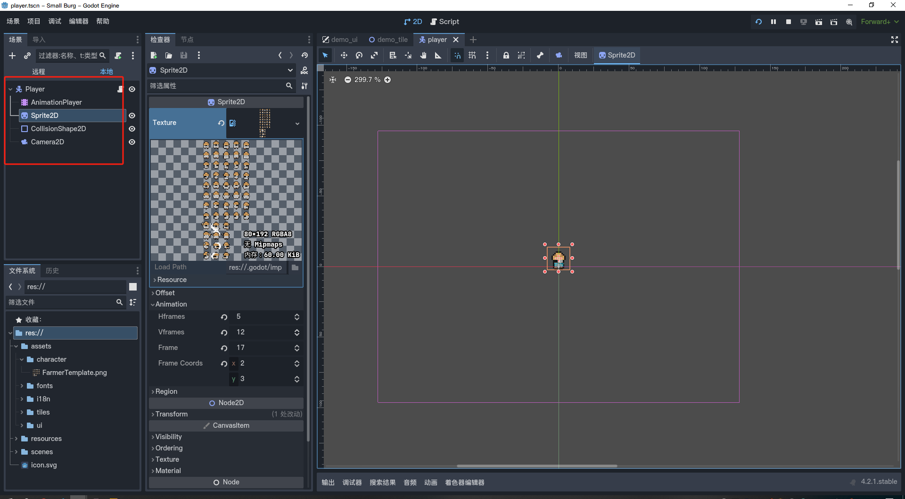
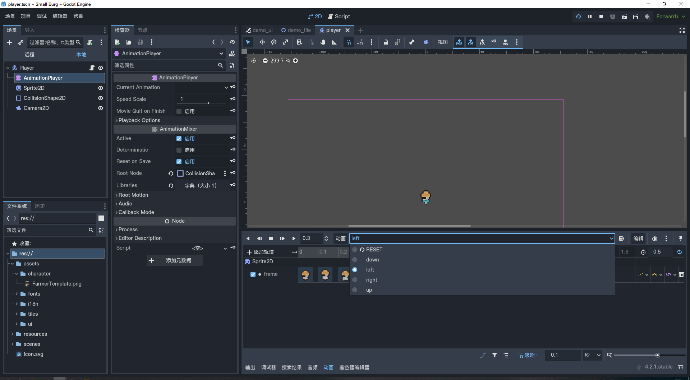
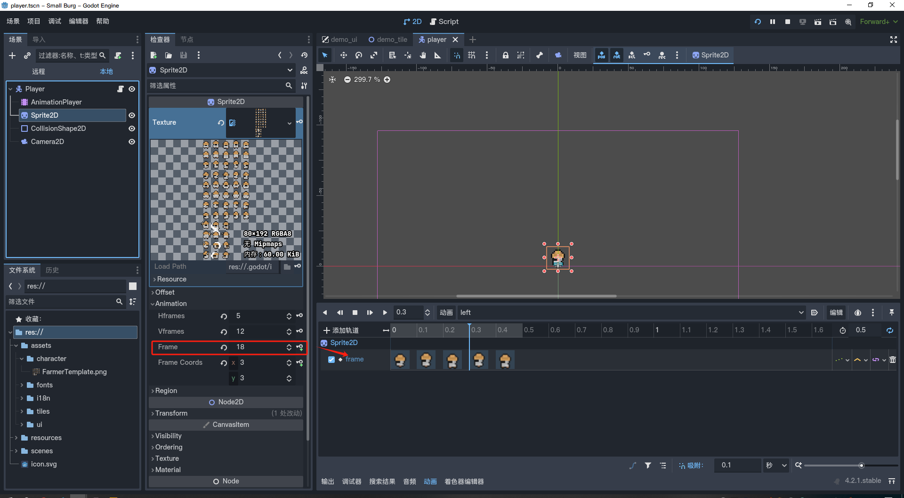
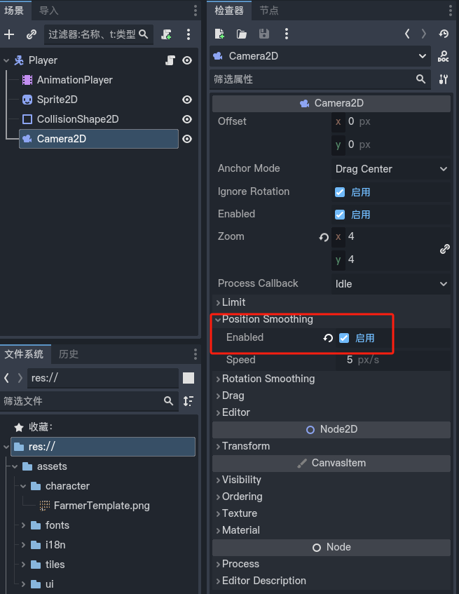

# Godot4-2d角色四方向移动

## 教学视频
[Godot 4 中流畅的2D相机跟随教程！（游戏开发教程）](https://www.bilibili.com/video/BV1Sc41117zK/?spm_id_from=333.1007.top_right_bar_window_history.content.click&vd_source=4d989ba6b454d89c69ef2944654ea621)

## 资源下载
[kenney](https://kenney.nl/)

## 添加节点


## 添加动画



## 在 Player 添加脚本
```gdscript
extends CharacterBody2D

@onready var animation_player = $AnimationPlayer

## 移动速度
var speed:float = 3500

func _physics_process(delta):
	var direction = Input.get_vector("move_left","move_right","move_up","move_down")
	if (direction.x < 0):
		animation_player.play("left")
	elif (direction.x > 0):
		animation_player.play("right")
	elif (direction.y < 0):
		animation_player.play("up")
	elif (direction.y > 0):
		animation_player.play("down")
	else:
		animation_player.stop()

	velocity = direction * speed * delta
	move_and_slide()

```


## 优化

### 位置平滑



