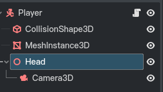

# Godot4-3d角色移动

> 站立部分逻辑未实现


## 教学视频
[Godot 4.X : Ultimate First Person Controller Tutorial ( 2023 )](https://www.youtube.com/watch?v=xIKErMgJ1Yk&list=RDCMUCQ8hqAX8i9mdcwrnu8e2sIg&start_radio=1&ab_channel=Lukky)

## 结构



## player 脚本

```gdscript
extends CharacterBody3D

@onready var head = $Head

## 当前速度
var current_speed = 5.0
const walking_speed = 5.0
const sprinting_speed = 8.0
const crouching_speed = 3.0
var lerp_speed = 10.0

const jump_velocity = 4.5

## 鼠标灵敏度
const mouse_sens = 0.25

## 移动方向
var direction = Vector3.ZERO

# Get the gravity from the project settings to be synced with RigidBody nodes.
var gravity = ProjectSettings.get_setting("physics/3d/default_gravity") * 1.3


func _ready():
	Input.set_mouse_mode(Input.MOUSE_MODE_CAPTURED)
	

func _input(event):
	if event is InputEventMouseMotion:
		rotate_y(deg_to_rad(-event.relative.x * mouse_sens))
		head.rotate_x(deg_to_rad(-event.relative.y * mouse_sens))
		head.rotation.x = clamp(head.rotation.x, deg_to_rad(-89), deg_to_rad(89))


func _physics_process(delta):
	if Input.is_action_pressed("crouch"):
		head.position.y = lerp(head.position.y, 0.3, delta * lerp_speed)
		
		current_speed = crouching_speed
	else:
		head.position.y = lerp(head.position.y, 0.8, delta * lerp_speed)
		
		if Input.is_action_pressed("sprint"):
			current_speed = sprinting_speed
		else:
			current_speed = walking_speed
	
	# Add the gravity.
	if not is_on_floor(): 
		velocity.y -= gravity * delta

	# Handle jump.
	if Input.is_action_just_pressed("ui_accept") and is_on_floor():
		velocity.y = jump_velocity

	# Get the input direction and handle the movement/deceleration.
	# As good practice, you should replace UI actions with custom gameplay actions.
	var input_dir = Input.get_vector("ui_left", "ui_right", "ui_up", "ui_down")
	direction = lerp(direction, (transform.basis * Vector3(input_dir.x, 0, input_dir.y)).normalized(), delta * lerp_speed)
	if direction:
		velocity.x = direction.x * current_speed
		velocity.z = direction.z * current_speed
	else:
		velocity.x = move_toward(velocity.x, 0, current_speed)
		velocity.z = move_toward(velocity.z, 0, current_speed)

	move_and_slide()

```
